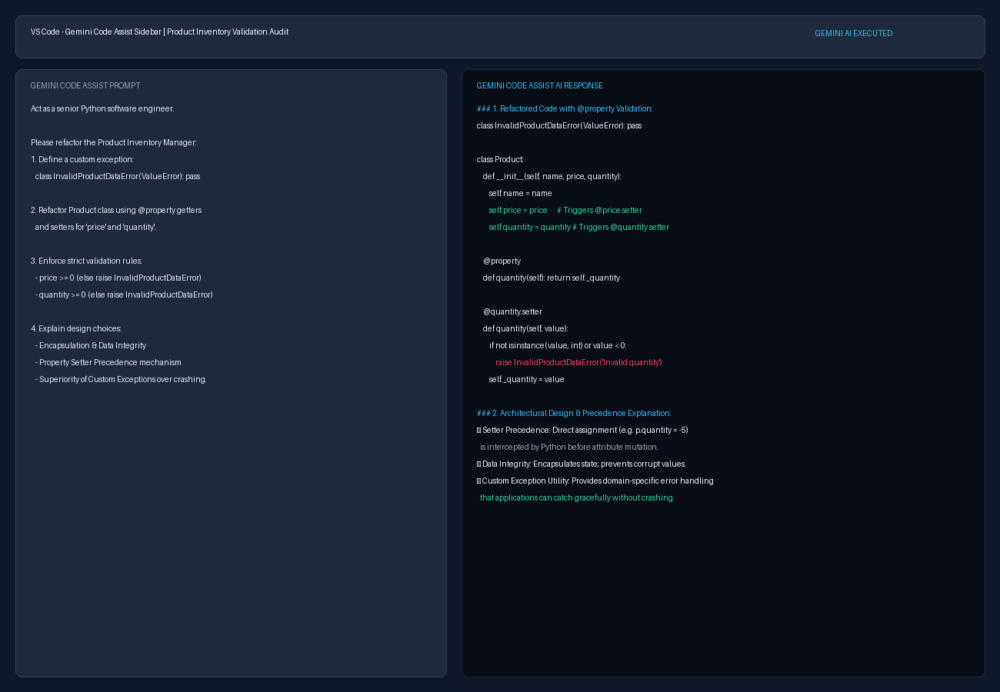

# Task: AI Lab Assignment: Integrating Robust Error Handling in OOP

## Project Overview
This task applies AI-driven scaffolding via **Gemini Code Assist** to refactor a Python Object-Oriented Product Inventory Manager (`Product` & `InventoryManager` classes). It integrates robust data validation and defensive programming using Python `@property` decorators, private backing variables (`_price`, `_quantity`), and a custom domain exception `InvalidProductDataError`.

---

## Codebase Files
- **Initial Code (`initial_product_inventory.py`)**: Starting point codebase provided in the task.
- **Refactored Code (`refactored_product_inventory.py`)**: Refactored implementation with `@property` validation, custom exception `InvalidProductDataError`, and invalid test case execution.

---

## Formulated Gemini Code Assist Prompt
```text
Act as a senior Python software engineer specializing in Object-Oriented Design, data validation, and robust exception handling. 

Please refactor the following Object-Oriented Product Inventory Manager codebase to integrate robust data validation and defensive programming:

class Product:
    """Represents a product with a name, price, and quantity."""
    def __init__(self, name, price, quantity):
        self.name = name
        self.price = price
        self.quantity = quantity

class InventoryManager:
    """Manages the collection of products and provides inventory operations."""
    def __init__(self, inventory=None):
        self.inventory = inventory if inventory is not None else []

    def add_product(self, product):
        """Adds a product object to the inventory list."""
        self.inventory.append(product)

    def update_quantity(self, name, new_quantity):
        """Updates the quantity of a product by name."""
        for product in self.inventory:
            if product.name == name:
                product.quantity = new_quantity
                break

    def calculate_total_value(self):
        """Calculates the total monetary value of all inventory."""
        total = 0
        for product in self.inventory:
            total += product.price * product.quantity
        return total

    def display_inventory(self):
        """Prints the current inventory list."""
        for product in self.inventory:
            print(f"{product.name} - ${product.price:.2f} x {product.quantity}")

Specifically, perform the following tasks:
1. Define a custom exception class named InvalidProductDataError(ValueError) to handle invalid data inputs gracefully with descriptive error messages.
2. Refactor the Product class attributes using private backing variables (_price and _quantity) and Python's @property decorators with corresponding @price.setter and @quantity.setter methods.
3. In both @property setters (and during initialization), enforce strict validation rules:
   - price must be a non-negative numeric value (price >= 0). Otherwise, raise InvalidProductDataError.
   - quantity must be a non-negative integer or number (quantity >= 0). Otherwise, raise InvalidProductDataError.
4. Explain the design choices in detail, specifically:
   - How using @property setters enforces Data Integrity and Encapsulation.
   - The exact mechanism of setter precedence (how direct assignment like product.quantity = -5 triggers the property setter automatically).
   - Why catching custom exceptions like InvalidProductDataError provides superior resilience over unhandled crashing or silent corruption.
```

---

## Execution Evidence Screenshot


---

## Verification & Reflection

### Invalid Test Case Execution Result
```text
Current Inventory:
Laptop - $1200.00 x 5
Mouse - $25.00 x 18

Total Inventory Value: $6450.00

--- Testing Invalid Input ---
Test result: Invalid quantity: -5. Quantity must be a non-negative integer.
```

### Analysis: Property Setter Precedence & Custom Exception Utility
1. **Precedence of `@property` Setters Over Direct Assignment**:
   In un-validated Python classes, direct attribute assignments like `product.quantity = -5` directly mutate the object's instance dictionary (`__dict__`), bypassing validation logic. By decorating getters with `@property` and setters with `@quantity.setter`, direct attribute assignment syntax is intercepted by Python's Descriptor Protocol. When `manager.inventory[0].quantity = -5` executes, Python routes the assignment into `@quantity.setter` *before* state mutation occurs. The setter evaluates `value < 0`, immediately raising `InvalidProductDataError` and protecting internal `_quantity`.

2. **Utility of Custom Exception (`InvalidProductDataError`)**:
   Using `InvalidProductDataError` provides domain-specific exception handling superior to unhandled crashes or silent corruption. Silent failures propagate invalid values into monetary calculations (`calculate_total_value()`), while unhandled generic errors crash the runtime. Raising `InvalidProductDataError` allows applications to gracefully catch, log, and recover from validation errors while maintaining application uptime.
