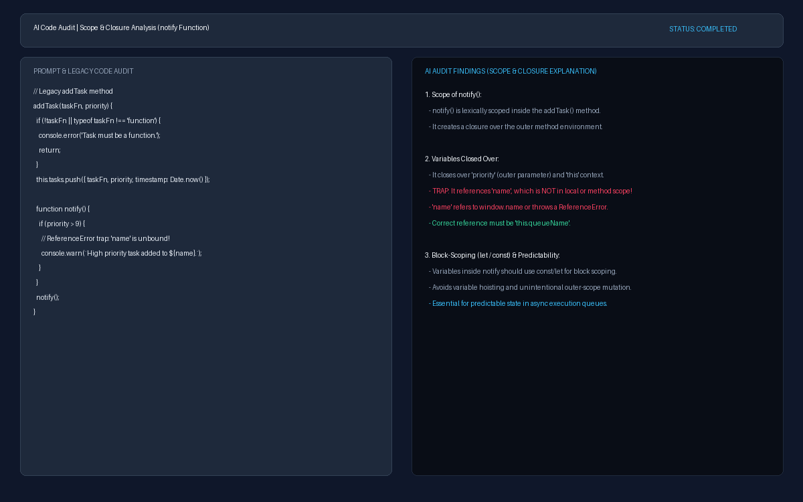
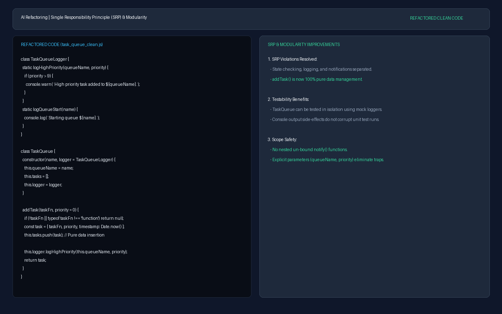

# Task: AI Lab: Pair Programming with AI - Part 2

## Project Overview
This task demonstrates structured prompt engineering methodologies to perform code auditing, scope/closure analysis, and architectural refactoring on a legacy JavaScript class (`TaskQueue`). By evaluating structural design principles such as the Single Responsibility Principle (SRP) and lexical scope mechanics, we transform a flawed, monolithic implementation into a clean, testable, and modular architecture.

---

## Code Base Links
- **Legacy Code (`task_queue_legacy.js`)**: [`task_queue_legacy.js`](./task_queue_legacy.js)
- **Refactored Code (`task_queue_clean.js`)**: [`task_queue_clean.js`](./task_queue_clean.js)

---

## Structured Prompts Used

### Prompt 1: AI-Assisted Audit (Scope & Closures)
> Act as a senior JavaScript engineer performing a code audit. Please analyze the `addTask` method in the following `TaskQueue` legacy code snippet:
>
> ```javascript
> class TaskQueue {
>   constructor(name) {
>     this.queueName = name;
>     this.tasks = [];
>     this.isProcessing = false;
>   }
> 
>   addTask(taskFn, priority) {
>     if (!taskFn || typeof taskFn !== 'function') {
>       console.error('Task must be a function.');
>       return;
>     }
>     this.tasks.push({ taskFn, priority, timestamp: Date.now() });
>     if (this.tasks.length === 1) {
>       console.log(`Starting queue ${this.queueName}.`);
>       this._startProcessing();
>     }
>     function notify() { 
>       if (priority > 9) {
>         console.warn(`High priority task added to ${name}.`);
>       }
>     }
>     notify(); 
>   }
> }
> ```
>
> Specifically:
> 1. Explain the scope of the nested `notify()` function and detail exactly what variables it closes over upon execution.
> 2. Identify any variables or parameters that are referenced inside `notify()` which create scope bugs or reference errors (such as attempting to reference `name` instead of `this.queueName`), and explain why.
> 3. Detail which variables should be properly block-scoped using `let` or `const` (rather than relying on outer function parameters or implicit globals) and why block-scoping is essential for predictable, bug-free execution in asynchronous or event-driven JavaScript environments.

### Prompt 2: AI-Assisted Refactoring (SRP & Modularity)
> Act as a software architect specializing in Object-Oriented Design and SOLID principles. 
> 
> Analyze the `addTask` method of `TaskQueue` from a Single Responsibility Principle (SRP) perspective:
> 1. Identify all SRP violations currently present inside `addTask` (specifically pointing out state checking, console logging, automatic queue processing/scheduling, and priority notification side effects).
> 2. Refactor the `TaskQueue` class by extracting the logging, notification, and process-scheduling side-effects out of `addTask` into a dedicated logger/notifier component (or separate helper class `TaskQueueLogger`).
> 3. Ensure that `addTask` becomes purely responsible for validating and appending the task object to the internal `this.tasks` array, while resolving the scope/closure issues in `notify` (eliminating unbound variable traps like `name`).
> 4. Provide the complete, refactored JavaScript implementation.
> 5. Explain in detail why this modular separation improves automated unit testability, decouples concerns, and enhances long-term codebase maintainability.

### Prompt 3: Verification Prompt
> Act as a principal code reviewer. Please review the updated `task_queue_clean.js` implementation below:
>
> ```javascript
> class TaskQueueLogger {
>   static logQueueStart(queueName) {
>     console.log(`Starting queue ${queueName}.`);
>   }
> 
>   static logHighPriority(queueName, priority) {
>     if (priority > 9) {
>       console.warn(`High priority task added to ${queueName}.`);
>     }
>   }
> 
>   static logInvalidTask() {
>     console.error('Task must be a function.');
>   }
> }
> 
> class TaskQueue {
>   constructor(name, logger = TaskQueueLogger) {
>     this.queueName = name;
>     this.tasks = [];
>     this.isProcessing = false;
>     this.logger = logger;
>   }
> 
>   addTask(taskFn, priority = 0) {
>     if (!taskFn || typeof taskFn !== 'function') {
>       this.logger.logInvalidTask();
>       return null;
>     }
> 
>     const task = {
>       taskFn,
>       priority,
>       timestamp: Date.now()
>     };
> 
>     this.tasks.push(task);
> 
>     this.logger.logHighPriority(this.queueName, priority);
> 
>     if (this.tasks.length === 1 && !this.isProcessing) {
>       this.logger.logQueueStart(this.queueName);
>       this._startProcessing();
>     }
> 
>     return task;
>   }
> 
>   _startProcessing() {
>     this.isProcessing = true;
>   }
> }
> ```
>
> Please perform a final verification and confirm:
> 1. Have all Single Responsibility Principle (SRP) violations inside `addTask` been completely resolved by extracting logging and notification side-effects into `TaskQueueLogger`?
> 2. Have all closure and variable scope traps from the legacy code (such as referencing unbound `name` or nested un-scoped functions) been properly eliminated?
> 3. Is `addTask` now purely focused on validating and adding tasks to the `this.tasks` array while maintaining high testability and clean separation of concerns?

---

## Evidence Screenshots

### 1. Scope & Closure Audit Explanation


### 2. SRP Refactoring & Code Output


---

## Reflection and Synthesis

### Leveraging LLM Pattern-Matching for Structural Audits
Large Language Models (LLMs) function primarily as sophisticated pattern-matching engines rather than deterministic code execution runtimes. Consequently, simply instructing an AI to "fix the code" often results in superficial patches that satisfy local syntax without restructuring underlying anti-patterns. By formulating explicit structural prompts targeting Single Responsibility Principle (SRP) violations and lexical scope closures, we leveraged the LLM's vast training corpus of architectural patterns to perform deep code auditing. In the `TaskQueue` exercise, auditing specifically for scope traps exposed how `notify()` attempted to close over an unbound `name` identifier (which would silently access `window.name` or throw a `ReferenceError`) and revealed how mixing queue state management with console logging side-effects compromised unit testability—insights a basic "fix the code" request or standard syntax linter would completely miss.
